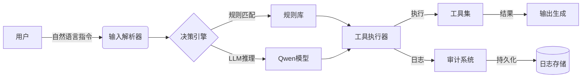

# 自主工具Agent架构设计
## 1 设计目标
- 支持CLI工具的动态集成与执行
- 规则+LLM混合决策机制
- 文件操作/系统监控工具优先实现
- 完备的操作审计日志

## 2 架构图


## 3 核心模块
### 3.1 输入解析器 (`input_parser.py`)
- 支持自然语言指令解析
- 上下文对话状态管理
```python
class InputParser:
    def parse(self, user_input: str, context: dict) -> Action:
        # 解析逻辑
```

### 3.2 混合决策引擎 (`decision_engine.py`)
**决策流程**：
1. 规则引擎优先匹配（预定义工具路由）
2. LLM处理未覆盖场景
3. 危险操作拦截机制

### 3.3 工具执行器 (`tool_executor.py`)
- 沙箱执行环境（进程级隔离）
- 支持同步/异步执行模式
- 实时流处理

### 3.4 审计系统 (`audit_logger.py`)
**日志格式**：
```json
{
  "timestamp": "2025-06-08T16:30:00",
  "tool": "file_copy",
  "params": {"src": "a.txt", "dest": "backup/"},
  "status": "success",
  "output": "Copied 1 file"
}
```

## 4 实施计划
### Phase 1：核心框架（2天）
- [ ] 实现Agent基类 (`agent_core.py`)
- [ ] 决策引擎骨架 (`decision_engine.py`)

### Phase 2：工具集成（3天）
- [ ] 文件操作工具集 (`tools/file_tools.py`)
- [ ] 系统监控工具集 (`tools/system_tools.py`)
- [ ] 工具注册机制 (`tool_registry.py`)

### Phase 3：增强功能（2天）
- [ ] 审计日志系统 (`audit_logger.py`)
- [ ] 沙箱执行环境 (`sandbox.py`)

## 5 风险控制
| 风险点 | 应对措施 |
|--------|----------|
| CLI注入攻击 | 命令白名单校验 |
| 资源泄露 | 进程资源限额 |
| LLM误操作 | 关键操作二次确认 |